## 🏋️ Virtual Gym Interface

A 2D Unity application simulating user interaction inside a virtual gym.

## 📌 Overview

This project is a Unity-based 2D application created for a Human–Computer Interaction (HCI) assignment.
It simulates a virtual gym environment through menus, buttons, panels, and other UI elements.

---

## 🎯 Features
🧭 1. 2D UI Navigation

-Screens for gym rooms, menu navigation, and interactions.

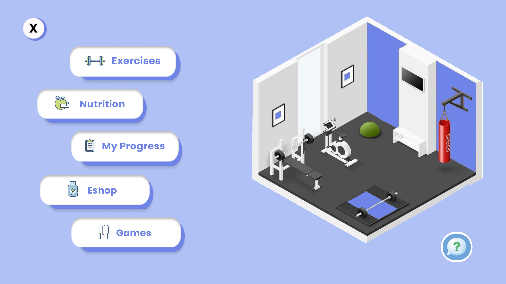

-A main menu guide for ease of navigation.

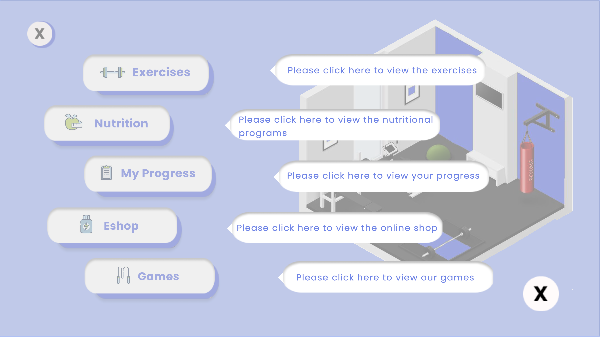

## 🧩 2. Exercise & Nutrition Information

-An interactive exercise selection screen showing all the available exercises per muscle group.

-A workout screen featuring videos to accompany users along with a timer

### Exercise Selection Screen

### Workout Screen
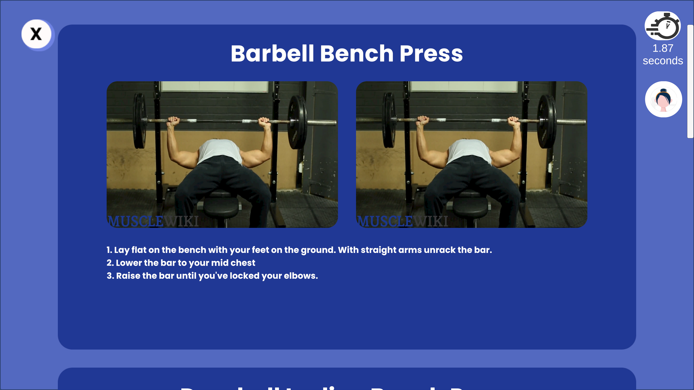

-A nutrition goal selection screen

-A nutrition screen with meal ideas for every meal of the day

### Nutrition Screen
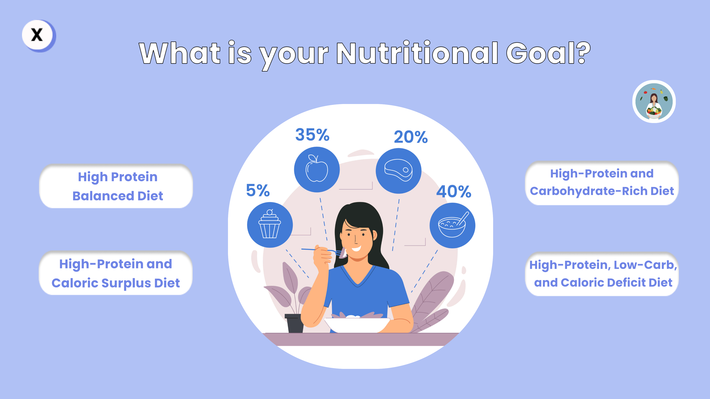

### Nutrition Tips

## 📈 3. Basic Progress Tracking

-Displays for user progress,including time spend exercising per muscle group,
calorie tracking and personal user info 

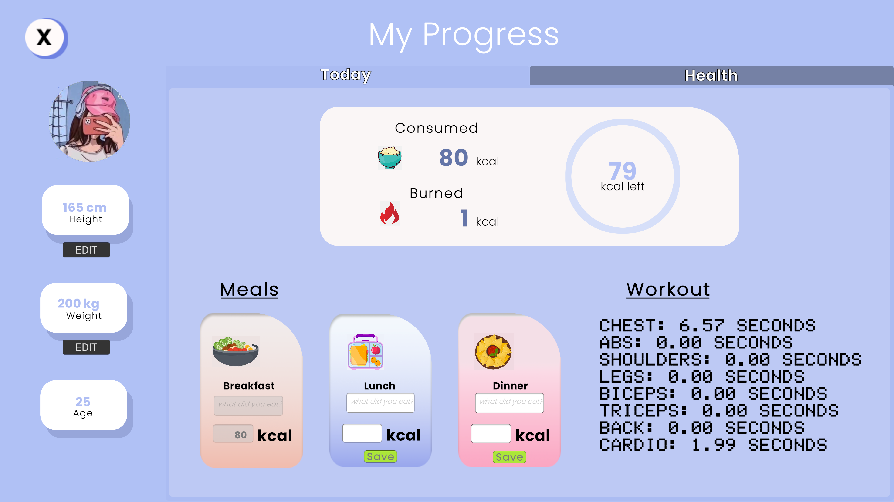

## 👥 4. Virtual Trainer & Nutritionist UI

-A question category selection for ease of choice.

- Dialog-like trainer interactions via button click.

### Question Category Selection
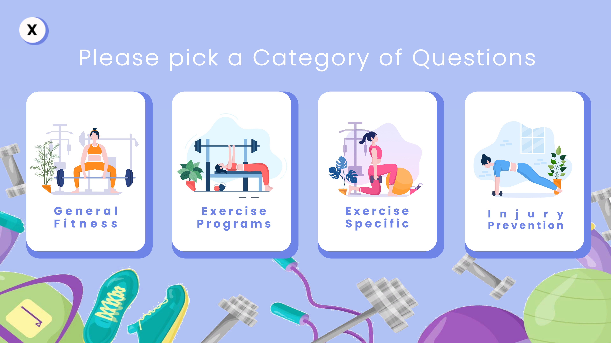

### Trainer UI
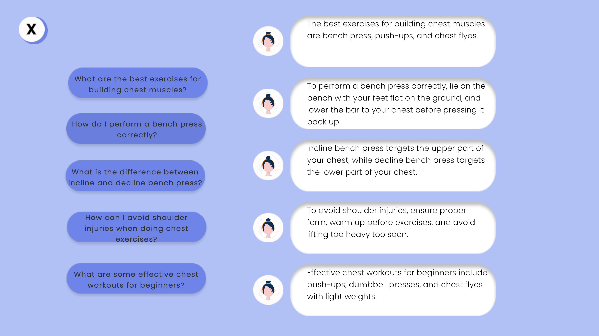

## 🛒 5. Product & Diet Program Shop

A UI simulation of purchasing gym products.

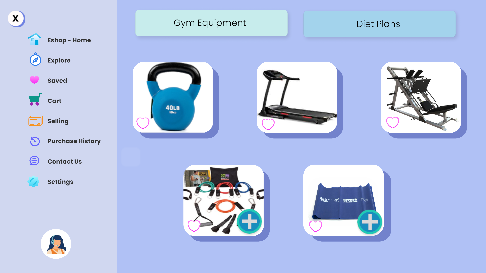

## 📝 6. Custom Workout Plans

Users can choose from premade workout plans according to their liking.

### Workout Goal Selection
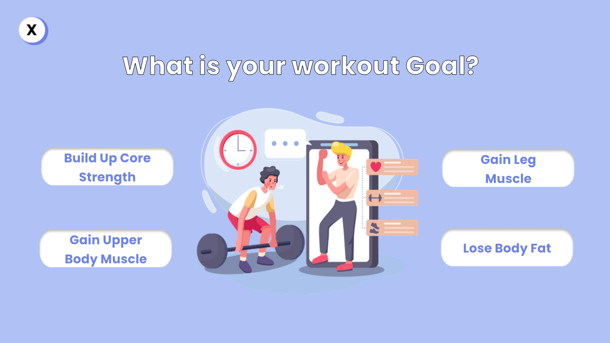

### Workout Plans 
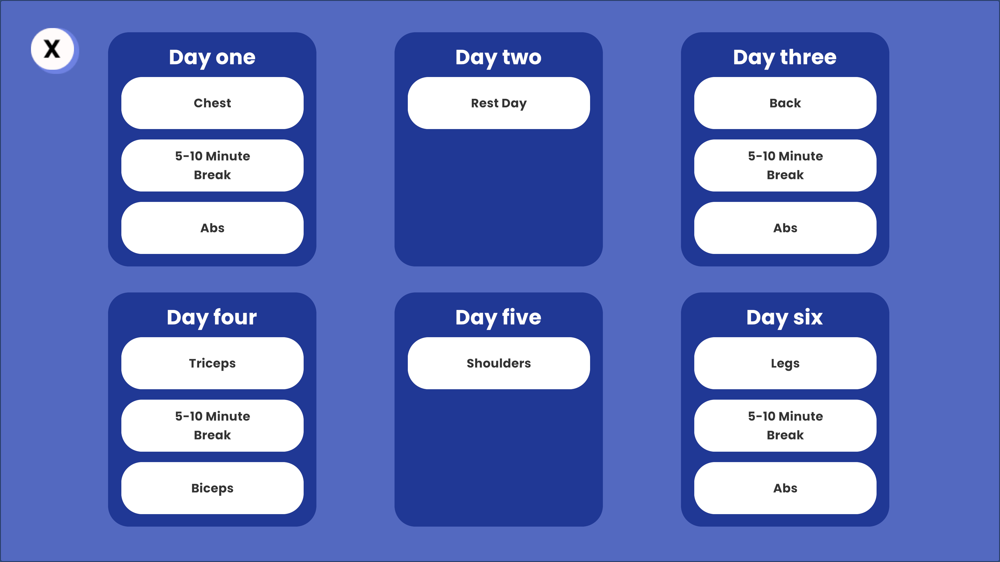

## 🎮 7. Interactive Quiz

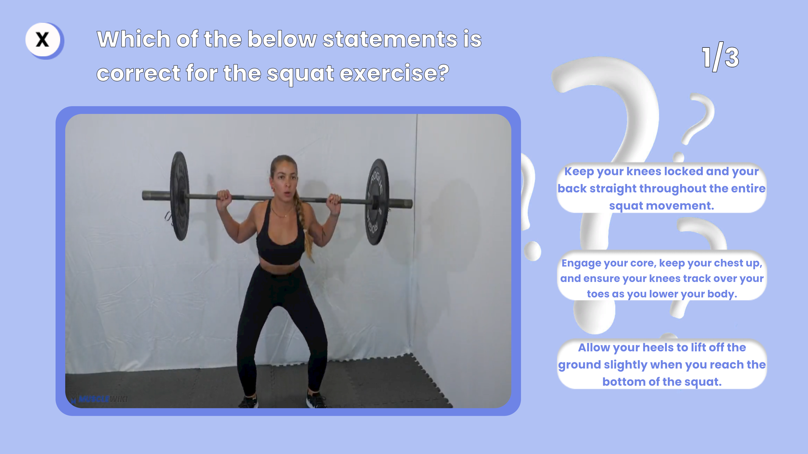
